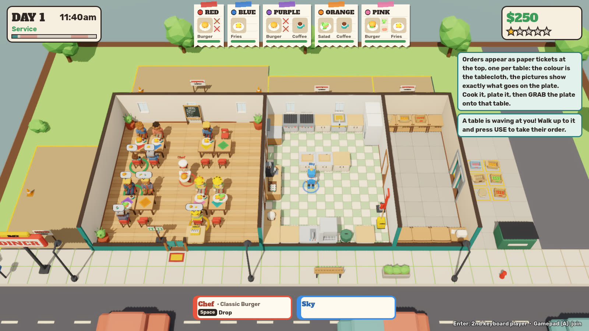
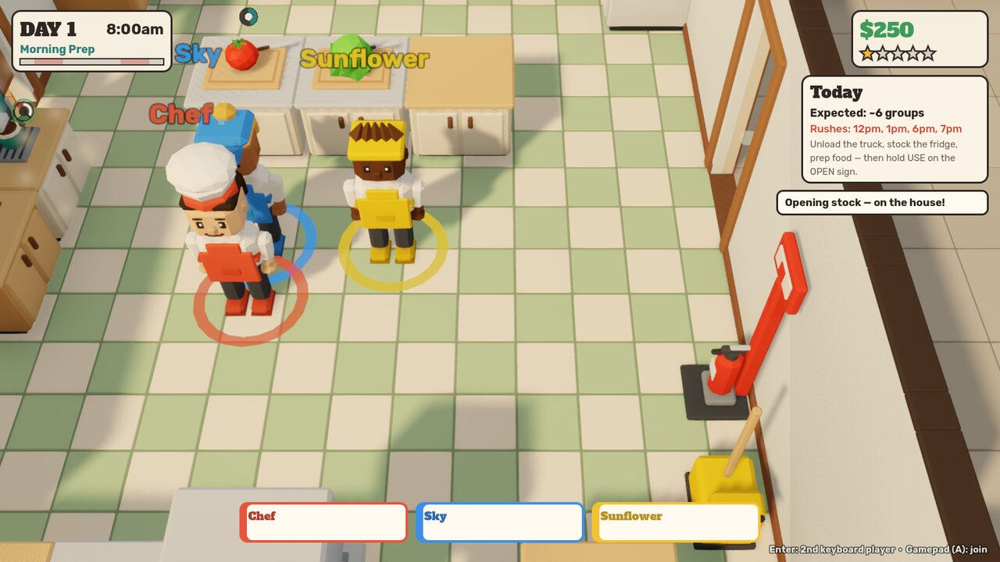
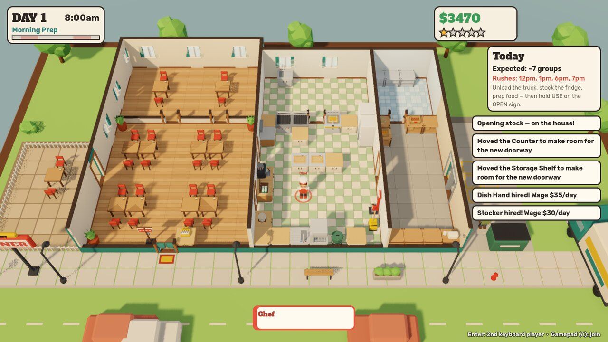
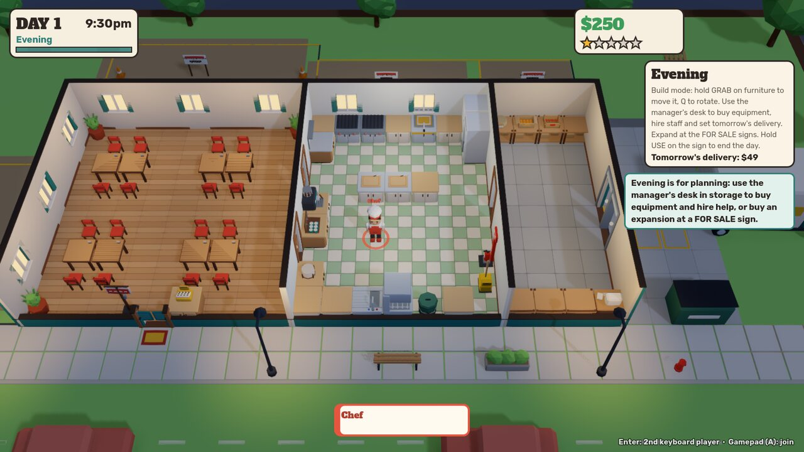
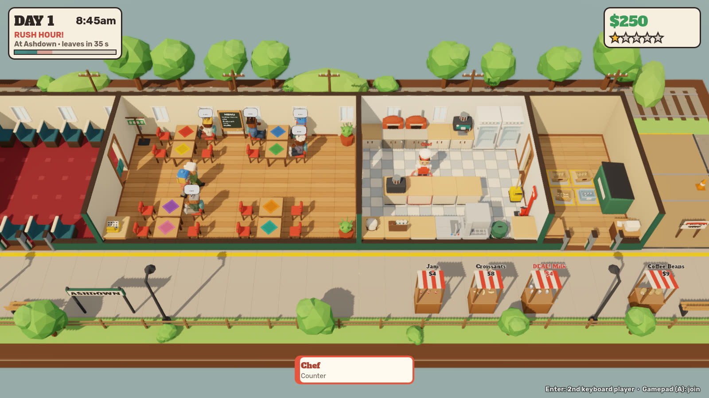
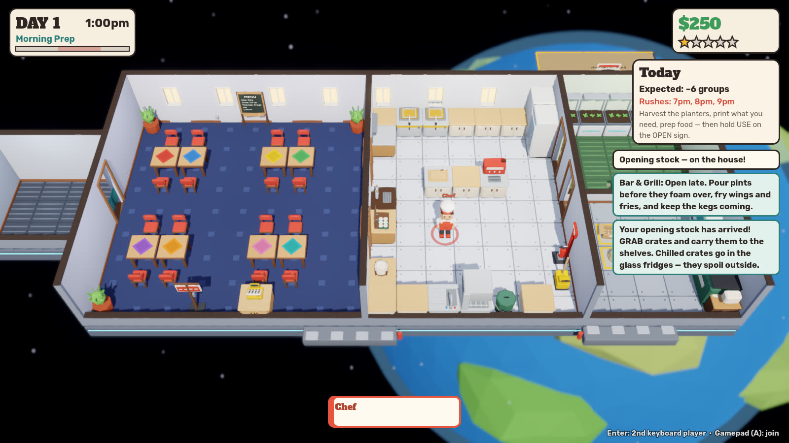
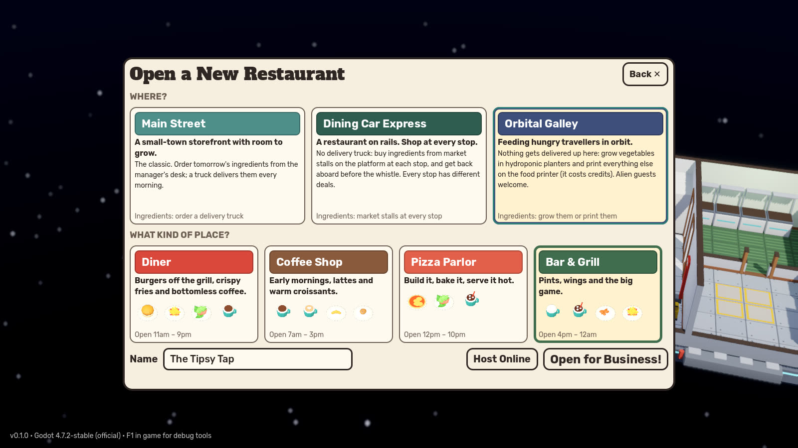
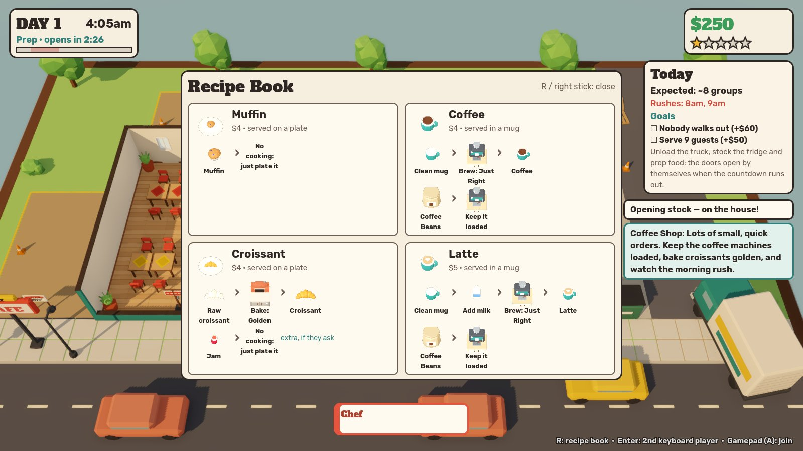

# Mise en Chaos

*A cooperative restaurant-logistics game for 1–6 players, built in Godot 4.*

> Build it. Stock it. Somehow keep it running.

You and your friends run a restaurant: a diner, a coffee shop, a pizza
parlor or a bar, on Main Street, aboard a train or in orbit. You aren't just cooking.
You also unload the morning delivery truck, keep the beef in the fridge before
it spoils, prep lettuce before the lunch rush, wash the plates you'll run out
of, put out grease fires, knock walls through and haul new equipment in from
the loading dock. You can hire staff and build conveyor lines. Over time the
little diner grows into a logistics machine you designed yourselves, and the
building shows every decision you made, good or bad.

The game is a polished vertical slice with an architecture meant to keep
growing: content is data, every system is network-ready, and a headless test
plays through a whole day.

| | |
|---|---|
|  |  |
| *Lunch service: tickets show each table's order* | *Local co-op during morning prep* |
|  |  |
| *All four expansions built* | *Evening planning, with plots for sale out back* |
|  |  |
| *The Dining Car Express between stations: locomotive in front, passenger cars behind* | *A bar in orbit: planters grow, the printer prints* |
|  |  |
| *Pick where and what when you open a new restaurant* | |

---

## Running the game

* **Engine:** Godot **4.3 or newer** (tested on 4.3-stable and 4.7.2-stable).
  Standard build, no C#.
* Open `project.godot` in the editor and press **Play**, or run
  `godot --path .` from the repo root.
* Renderer: Forward+ (soft shadows, SSAO, tilt-shift depth of field). The
  Compatibility renderer also works, with fewer effects.
* **New Restaurant** asks where and what: pick a place (Main Street, the
  Dining Car Express train, or the Orbital Galley space station) and a kind
  of restaurant (Diner, Coffee Shop, Pizza Parlor, Bar & Grill). The picture
  behind the menu previews your choice.
* **Difficulty:** Settings → Difficulty (main menu or pause menu).
  *Relaxed* has patient guests, longer prep and rare disasters, *Normal* is
  the default, and *Hectic* is the full rush. In online games the host's
  setting applies.

Command-line shortcuts, for development:

| Argument | Effect |
|---|---|
| `-- --autostart` | Skip the menu and start a new offline game |
| `-- --format=bar --location=express` | With `--autostart` or `--host`: pick the restaurant type and place |
| `-- --host` | Host an online game immediately |
| `-- --join 1.2.3.4` | Join a host |
| `-- --coop-test` | Start with two local keyboard players |

---

## Controls

All verbs are contextual. **GRAB** moves things and **USE** operates things.

| | Keyboard A | Keyboard B | Gamepad |
|---|---|---|---|
| Move | WASD (or arrows when solo) | Arrows | Left stick / D-pad |
| Grab / place / drop | Space | Enter | A |
| Use (chop, wash, take one, repair, spray) | E or F | Right Shift | X / RT |
| Rotate (build) / ping | Q | / | Y |
| Sprint | Shift | Right Ctrl | B / LT / LB |
| Recipe book | R | R | Right stick click |
| Pause | Esc | | Start |

* **Moving furniture:** before opening and in the evening, **GRAB** an empty
  counter or appliance to pick it up. If something is on it, **hold GRAB** and
  it comes along. Q rotates it, GRAB places it.
* **Recipe book (R):** an optional card for each dish on today's menu,
  showing every ingredient as pictures from raw to ready (potato › chop ›
  fryer › fries). It doesn't pause the game. It's also in the pause menu.
* **USE on a crate** takes one ingredient out. **GRAB** picks up the whole crate.
* **Menus** (catalog, menu board) work with WASD, the arrow keys or a
  gamepad; the list scrolls with the selection.
* **Tab** toggles the full-restaurant view. **+/–** or the mouse wheel zooms.
  **F5** quick-saves. **F1** opens the debug panel.
* **Local co-op:** press **Enter** to add a second keyboard player, or **A** on
  any gamepad to join, at any time during a game.

---

## How a day works

```
MORNING PREP (against the clock: 100 seconds on Normal, a bit longer on day one)
  The delivery truck reverses to the loading dock and drops what you ordered.
  Carry crates inside (cold stock goes in the fridge), chop, arrange.
  The forecast card shows expected guests, rush hours and today's two goals.
  A few seconds before opening, the first guests turn up and wait at the door.
        ↓  hold USE on the OPEN sign when you're ready, or the doors open by
           themselves when the countdown runs out
SERVICE (timed, in about 7 minutes: 11am–9pm for the diner, 7am–3pm for
the coffee shop, 12pm–10pm for pizza, 4pm–midnight for the bar)
  Guests queue outside, get seated, read the menu, wave for you to take their
  order, wait (patience shown on faces, bubbles and tickets), eat, pay and
  leave dirty plates and crumbs behind. Lunch and dinner rushes are predictable.
        ↓  9pm: doors close
CLOSING
  No new guests. Finish the last tables; the day ends by itself once the
  dining room is empty.
        ↓
RESULTS
  Revenue, expenses, profit, guests served or lost, satisfaction, reputation,
  ingredient usage and waste.
        ↓
EVENING (calm, build mode)
  Order tomorrow's supplies (the truck brings nothing else), buy equipment (it
  arrives boxed at the dock), hire staff, build expansions at the FOR SALE
  signs, knock doorways through walls, and rearrange.
        ↓  hold USE on the OPEN sign when you're ready: lights out → next morning (autosave)
```

### Kinds of restaurant

Each kind has its own menu, opening hours, regulars, kitchen equipment and
supplier list.

| Restaurant | Menu | How |
|---|---|---|
| **Diner** | Burger, fries, salad, coffee | Grill a patty to *Medium* and plate it with a bun; guests pick their own extras (lettuce, tomato) and the ticket shows exactly which. Chop and fry potatoes; chop a salad; mugs under the coffee machine |
| **Coffee Shop** (7am–3pm) | Coffee, latte, croissant, muffin | Lots of small quick orders and a big morning rush. Milk in a mug, then coffee on top, is a latte. Bake croissants in the oven until golden (jam optional). Muffins are baked by the trayful: flour and an egg in the mixing bowl, hold USE to whisk, bake the tray golden, then USE it to take muffins out (straight onto a plate you're holding) |
| **Pizza Parlor** (12pm–10pm) | Pizza, salad, soda | Build the pizza on a plate (dough, sauce, cheese, plus pepperoni or sliced mushrooms if the guest wants them) and bake the whole plate in the oven. Sodas come from the fountain |
| **Bar & Grill** (4pm–midnight) | Beer, soda, wings, fries | Pour pints under the tap and take them before they foam over; swap in a fresh keg when it runs dry. Fry wings (dip optional) and fries. Sports fans arrive for the evening game |

### Places to run it

| Place | Where ingredients come from |
|---|---|
| **Main Street** | A storefront with room to grow. Order tomorrow's supplies at the manager's desk; a truck delivers them every morning |
| **Dining Car Express** | The restaurant is a train: passenger cars behind, the locomotive in front, everything up on its wheels above the track. Guests walk in from the passenger cars, and more hop on at every stop. There's no truck: in the morning the depot market is open on the platform, and the train stops three times during service. At each stop market stalls sell a few things (one is always a deal) and passengers board. When the whistle blows the doors lock and the train leaves, and anything still on the platform is left behind |
| **Orbital Galley** | A space station. Nothing is delivered: hydroponic planters grow vegetables for free (USE picks the crop, GRAB harvests), and the food printer prints everything else for credits (USE picks what it prints). Some guests are aliens |

Cooking is quick and the "perfect" window is generous; the challenge is
juggling everything at once, because guests won't wait long. Cooking passes
through readable stages: raw → rare → **medium** → well done → overcooked →
burnt, then fire. You can read the stage from colour, steam and
smoke, a chime, and a ring with a marked perfect zone. Customers refuse raw,
burnt or spoiled food.

---

## Features in this build

* **Physical inventory.** Ingredients arrive in wooden crates, burlap sacks
  and cardboard cartons, and you can see every unit inside them. Anything that
  must be kept cold (beef, lettuce, milk, cheese, wings) comes in a **silver
  cooler with blue snowflakes** and spoils outside the fridge. Low-stock
  alerts work from the actual crates.
* **Deliveries and logistics.** The truck brings only what you order at the
  manager's desk (tick *Auto* on a supply to get it every morning). It reverses
  to the dock and the crates land as obstacles. Day one comes with free opening
  stock. Rush orders and equipment come by van, sometimes mid-service. The
  driver takes empty crates left on the dock.
* **Finite dishware.** Plates, mugs and glasses get dirty and must go through
  the sink (a dishwasher is something you buy). If nobody washes up, you
  can't serve anything. Sodas come in a tall iced glass with a straw and
  beer in a foamy pint, so they never look like coffee. Drinks go down as
  guests drink them, and a finished one is an empty cup with dregs in it.
* **Customers.** Thirteen archetypes (townsfolk, families, work crews, business
  lunches, dates, tourists, tired travelers, the Regular, food critics,
  commuters, students, sports fans, night owls), each with different
  group size, appetite, patience, timing, spending and mess. Groups seat
  themselves at table clusters (push tables together for bigger groups),
  order, eat, pay and tip based on quality and speed.
* **Disasters.** Grease fires that spread and need the extinguisher, power cuts, dishwasher,
  fridge and appliance breakdowns, pipe leaks that make the floor slippery,
  conveyor jams and health inspections. Nothing outside the restaurant changes
  how many guests come: the lunch and dinner rushes are reliable.
* **Build mode.** Move and rotate any fixture on a grid, knock doorways through
  walls or wall them up, and buy expansions: Dining Annex, Dish Room, Walk-in
  Cooler (everything inside stays fresh) and Sidewalk Patio.
* **Tables come with chairs** (like PlateUp): every side of a table that faces
  free dining-room floor gets a chair. Pick a table up with one GRAB press
  before opening or in the evening, put it anywhere, and push tables together
  to seat bigger groups; joined tables share one cloth colour and lose the
  chairs between them.
* **Guests stay front of house.** They walk only through the dining room, the
  patio, the street (and the train's coaches and the station's airlock), never
  through the kitchen, storage or cooler. Only the health inspector goes back
  there.
* **Decor that does something** (like PlateUp's furniture). In the dining room,
  plants make guests wait longer, the jukebox makes them eat faster, wall art
  raises tips and rugs mean less mess. Each kind is capped, and the catalog
  shows what your decor adds up to.
* **Waiting benches.** Guests at the front of the line sit down and lose
  patience much more slowly.
* **Equipment upgrades.** Safety grill, fryer and oven (food holds at perfect
  and never burns or catches fire, but cooks a bit slower), a turbo grill
  (fast, but watch it), a rapid sink, a large bin and a fire sprinkler that
  puts out nearby fires by itself and leaves a puddle to mop.
* **Staff.** A Dish Hand, Busser, Stocker and Waiter. They follow simple,
  predictable routines through the same interaction rules as players.
* **Automation.** Conveyor belts, grabber arms (which pull single units out of
  crates) and an auto-chopper. Chain them into visible production lines.
* **Multiplayer.** Up to 6 players: local co-op with keyboards and gamepads,
  online over ENet (host/join), or a mix. The server is authoritative and
  supports late join.
* **Persistence.** One restaurant persists across days in versioned JSON saves,
  with an autosave every morning. Failure costs you reputation, stock and money
  but doesn't wipe the restaurant.
* **Presentation.** Procedural low-poly miniature-diorama art: chamfered model
  pieces, baked AO, a display plinth, a cutaway building with "section cut"
  wall caps, tilt-shift blur, and lighting that follows the time of day. The
  sun's shadow map is fitted to the camera so chair legs cast crisp shadows
  (Settings → "Sharp shadows" can be turned off on slower PCs). There is
  layered adaptive music (prep → service → rush) and 60+ sound effects.
* **Paper tickets.** One small slip per table in a band along the top of the
  screen, most impatient first. Tables are named by the colour of their cloth
  ("Red table"); each dish shows a picture of exactly what to make, with its
  optional extras beside it (crossed out when the guest doesn't want them).
  The camera always frames the restaurant below the band, and any panel you
  walk behind fades out, so the HUD never hides the game. Pick up a finished
  dish and every guest waiting for exactly that gets a green ring.
* **Clear stakes.** A table that walks out is announced with what it cost
  (stars and the lost sale); the stars flash; the results say how many guests
  to expect tomorrow because of it. Happy tables in a row build a **streak**
  that raises tips by up to 50% until someone walks out, and every day has
  **two goals** (serve so many guests, nobody walks out, perfect dishes...)
  that pay a bonus.
* **Menu board.** Run out of tomatoes? Cross them off on the chalkboard menu:
  guests stop ordering dishes that need them and stop asking for them as an
  extra. Guests who wanted them are a little disappointed, which beats an
  order that never comes.
* **Debug panel (F1).** Spawn customers or deliveries, add money, advance time,
  start or end service, trigger disasters, show the nav grid and AI states,
  reset the restaurant.

---

## Project layout

```
res://
  scenes/            main, world, player, appliances/, furniture/, automation/
  scripts/
    core/            GameWorld (entity registry, session), Entity, EventBus, ContentDB, Main
    systems/         Day, Economy, Orders, Customers, Deliveries, Build, Events,
                     Staff, Inventory, Recipes, Audio, Saves, Settings, FX
    networking/      Net (ENet + RPC endpoints), Replicator
    interaction/     InteractionSystem, Interact rules, ItemSlot
    items/           Item, FoodItem, DishItem, CrateItem, ToolItem, PackageItem
    fixtures/        Fixture + components/ (Cooker, Processor, Sink, Dishwasher, ...)
    ai/              Customer, CustomerGroup, Worker, StaffBrain, GridNav
    player/          PlayerCharacter, input devices (local co-op)
    restaurant/      RestaurantGrid (rooms/walls/doors as data), RestaurantBuilder
    themes/          TrainLine (timetable, platform, market), SpaceOrbit (starfield)
    art/             MeshBuilder, Models library, CharacterRig, palette
    ui/              HUD, catalog, results, menus, theme, icon renderer
    resources/       Resource classes (ItemDef, RecipeDef, FixtureDef, ...)
  resources/         All game content as .tres (ingredients, recipes, equipment,
                     customers, events, staff, upgrades/expansions, rooms, formats, locations)
  data/layouts/      Starting restaurant layouts (same format as saves)
  shaders/           Diorama material, highlight, ghost, sky, water
  audio/             sfx/*.wav, music/*.ogg (procedurally generated placeholders)
  art/               fonts (OFL), models/ (drop-in overrides for procedural meshes)
  tests/             Headless gameplay tests, two-process network tests
  tools/             Content seed, screenshot runner, script checker, z-fight scan,
                     audio generator
  docs/              Architecture, design and content guides
```

More detail:

* [`docs/ARCHITECTURE.md`](docs/ARCHITECTURE.md): entities, authority and
  replication, the interaction protocol, components, saves.
* [`docs/DESIGN.md`](docs/DESIGN.md): pillars, how this differs from the genre,
  system design, roadmap.
* [`docs/CONTENT_GUIDE.md`](docs/CONTENT_GUIDE.md): adding recipes, ingredients,
  equipment, customers, events, expansions, art and audio.

---

## Testing

```bash
# Full-day gameplay test: delivery, prep, cooking, plating, customers, washing,
# build mode, disasters, staff, automation, spoilage, closing, results,
# expansions, patio fences, power cut, save/load, difficulty, regressions
# (about 220 checks; the exact number depends on what the guests order).
godot --headless --path . res://tests/test_runner.tscn

# Every kind of restaurant: its kitchen, pantry, supplier, hours and
# signature dishes (latte, croissant, pizza in the oven, pints, wings).
godot --headless --path . res://tests/format_test.tscn

# The new-game screen, the train (stops, stalls, doors, left-behind crates)
# and the space station (planters, food printer, alien guests).
godot --headless --path . res://tests/theme_test.tscn

# Two simulated days with a serving bot; any place and restaurant type.
godot --headless --path . res://tests/soak_test.tscn -- --location=express --format=bar

# Network tests: one host process and one client process on localhost.
godot --headless --path . res://tests/net_test.tscn -- --net-host &
godot --headless --path . res://tests/net_test.tscn -- --net-client
godot --headless --path . res://tests/net_theme_test.tscn -- --net-host &
godot --headless --path . res://tests/net_theme_test.tscn -- --net-client

# Compile every script.
godot --headless --path . res://tools/dev/check_all.tscn

# Screenshots of staged scenarios (needs a display or Xvfb).
godot --path . res://tools/dev/shot_runner.tscn -- --shot=out.png --scenario=dining

# Dump every visible triangle to look for overlapping surfaces that flicker
# (z-fighting); see the script header for the output format.
godot --headless --path . res://tools/dev/zfight_scan.tscn -- --out=tris.bin --expanded
```

Run `godot --headless --path . --import` once before the first headless run, so
Godot builds its class cache and imports the assets.

---

## Credits and licenses

* Code, procedural models, shaders and generated audio: original to this project.
* Fonts: **Alfa Slab One** (JM Solé) and **Rubik** (The Rubik Project Authors),
  both under the SIL Open Font License 1.1. See `art/fonts/OFL-*.txt`.
* Audio is synthesized by `tools/audio/generate_audio.py` (numpy + ffmpeg). The
  files are placeholders meant to be replaced by recordings under the same names.
